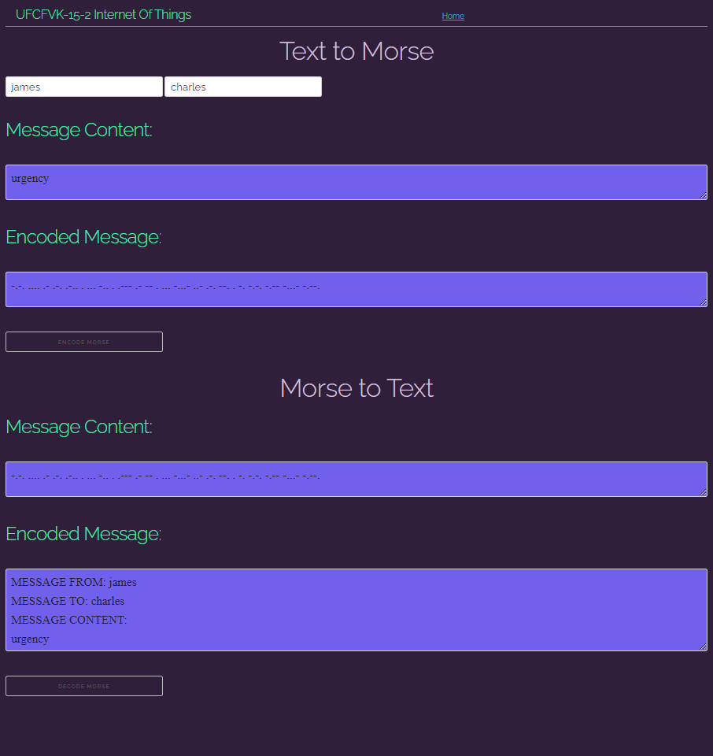

# UWE Assignment Year 2 | Internet Of Things | Worksheet 2 Part 2
This github repo contains the resources for worksheet 2 part 2

## Contents
1. [Task 1](#Task-1)
2. [Task 2](#Task-2)
3. [Task 3](#Task-3)

## Task 1
In this task we had to create what is known as a binary heap. A binary heap is a linear representation of a complete binary tree. In this task our binary heap is represented as a python list of chars. 

In task 1 we had to implement the following function:
```python
decode_bt( str : message ) : return str
```
It would take in our morse code message and return the decoded message using a binary heap. We had to create an algorithm that would do this using the following rules:
```python
# sample binary heap
binary_heap = list( "-ARWL-" )

# starting index is 1
x = 1
# returns the first left branch char of the binary tree e.g. a . in morse
binary_heap[ 2 * x ] # returns A
# returns the first right branch char of the binary tree e.g. a - in morse
binary_heap[ ( 2 * x ) + 1 ] # returns R

# the morse code to decode would be: .- = AR
```
The algorithm I created would traverse the linear representation of our binary tree (heap) with the given morse code segment. And will construct our decoded message.

**You can run my main.py script in the "Task 1" folder which contains 5 asserts to test decoding with the binary heap, make sure the other files in this folder are present for the testing to successfully work. These scripts where tested upon Python 3.8.7 upon the "csctcloud.uwe.ac.uk" server.**

## Task 2
In this task we had to understand and explore how "Ham Radio Conversations" were conducted. This involved port forwarding a port "10101" from the remote development server. We connected to a site via "localhost:10101". This allowed us to understand how the messages are constructed and decoded better.



In this we also had to implement 2 new additional functions as follows:
```python

# encoding will take in a sender the recipient and the a message payload
# the arguments passed are all strings and will return a string encoded in morse code
encode_ham(sender: str, receiver: str, msg:str) -> str
encode_ham("charles","james","urgency")

output: 

    ".--- .- -- . ... -.. . -.-. .... .- .-. .-.. . ... -...- ..- .-. --. . -. -.-. -.-- -...- -.--."

# decode ham will take in a ham conversation morse code message and will decode the message to return the sender, recipient, message
decode_ham(msg:str) -> (str, str, str)
decode_ham(".--- .- -- . ... -.. . -.-. .... .- .-. .-.. . ... -...- ..- .-. --. . -. -.-. -.-- -...- -.--.")

output:

    decoded_raw: jamesdecharles=urgency=(,
    sender: charles,
    rec: james,
    content: urgency
    ('charles', 'james', 'urgency')

```

Encode ham will be responsible for converting our a message and given arguments into the ham radio conversation style by grouping sender and receiver names separated with the char set "de" in this example. Charles is the sender, the receiver is james the formatted message for the ham radio conversation will be "charlesdejames" we then append an equals along with our message. at the end of our message we will append "=(" to mark the end of the message.

The decode ham will decode the ham conversation style message to return us separate values into a turple. This turple will contain the sender, receiver and the message in that order. 

**You can run my main.py script in the "Task 2" folder which contains 10 asserts to test ham encoding and decoding, make sure the other files in this folder are present for the testing to successfully work. These scripts where tested upon Python 3.8.7 upon the "csctcloud.uwe.ac.uk" server.**

## Task 3

For the final task in this worksheet. We had to establish a web socket connection to a remote server using the given URI
```python
uri = "ws://localhost:10102"
```
The server we are connecting to provides only 2 types of services. 
* Echo sends back the same message to the sender (receiver and senders are encoded differently)
* Time sends back the time in the message content

These server functions will be used to test our program to make sure our ham encoding and ham decodings actually work. and will be put to the test

In the given code below, you can see the test code that I will be using for running these tests. We have an expected output that should be matched when we invoke these functions.

```python
def test_send_echos(): # perform 5 send echos
    print("test_send_echos start")
    assert asyncio.run( morse.send_echo("s","test") ) == ('echo', 's', 'test'), "Should be ('echo', 's', 'test')"
    assert asyncio.run( morse.send_echo("james","helloworld") ) == ('echo', 'james', 'helloworld'), "Should be ('echo', 'james', 'hello world')"
    assert asyncio.run( morse.send_echo("charles","amazing") ) == ('echo', 'charles', 'amazing'), "Should be ('echo', 'charles', 'amazing')"
    assert asyncio.run( morse.send_echo("josh","buyxrp") ) == ('echo', 'josh', 'buyxrp'), "Should be ('echo', 'josh', 'buyxrp')"
    assert asyncio.run( morse.send_echo("allice","rooos") ) == ('echo', 'allice', 'rooos'), "Should be ('echo', 'allice', 'rooos')"
    print("test_send_echos PASSED") 

def test_send_time(): # perform a test for send time
    print("test_send_time start")

    import time # for checking date time
    # get time for gmt
    current_time = time.strftime("%H:%M:%S", time.gmtime())

    # get the result from the send_time
    result = asyncio.run( morse.send_time("s") )
    print(f"system time: {current_time},\nsend_time response: {result[2]}")

    # if for what ever REASON this returns false it seems the server time is different to your system time
    assert asyncio.run( morse.send_time("s") ) == ('time', 's', current_time), f"Should be('time', 's', {current_time})"
    print("test_send_time PASSED") 
```

Test send echos will send 5 different senders with 5 different messages to test the echo functionality. if there are any problems the assert function will be invoke an exception to tell us something went wrong here.

The test send time will fetch out system time for gm time and compare it to the one on the server. on success the times should match as long as the internet speed or connection to resolve the messages does not exceed 1 second.

**You can run my main.py script in the "Task 3" folder which contains 6 additional asserts from the previous task that will test send echo and send time functions, make sure the other files in this folder are present for the testing to successfully work. These scripts where tested upon Python 3.8.7 upon the "csctcloud.uwe.ac.uk" server. Please make sure your system time is correct, send_time code will convert system time to GMT to match the server time.**
